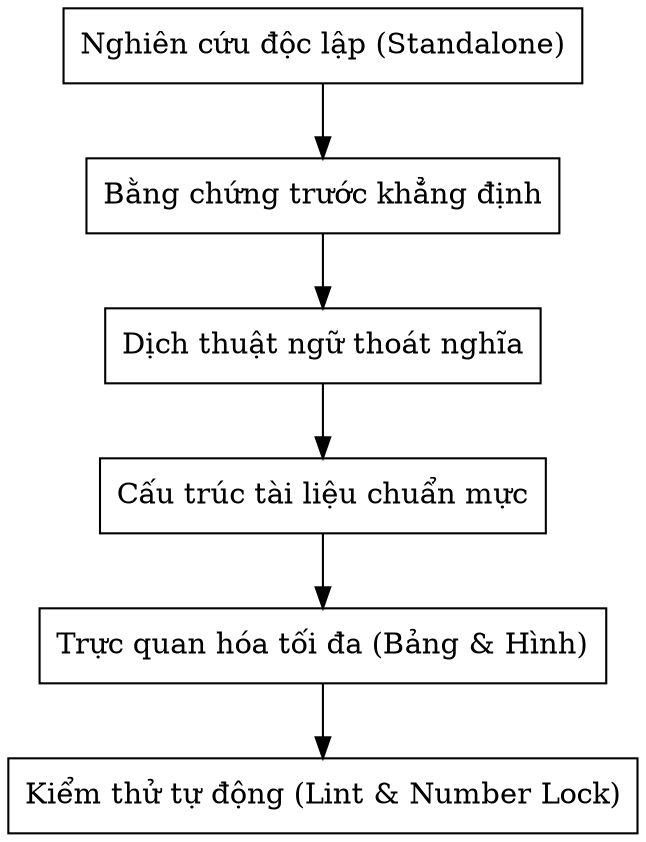

# Writing Scientific Theses & Reports in Vietnamese

## Overview
A comprehensive guideline and reference skill for drafting, auditing, refining, and compiling high-standard graduation theses (Đồ án / Khóa luận tốt nghiệp) and scientific research reports in Vietnamese. It enforces academic independence, natural terminology translation, empirical number locking, rich visual presentation, and automated static verification.

---

## 1. Core Principles



### 1.1. Nghiên Cứu Độc Lập Tuyệt Đối (Self-Contained / Standalone)
- **Tuyệt đối không nhắc lại các giai đoạn cũ**: Không so sánh hay đề cập tới báo cáo chuyên đề trước, phiên bản sơ khởi, thử nghiệm cũ, hoặc số ước tính ban đầu trừ khi đề tài có mục đích so sánh lịch sử có chủ đích.
- Đồ án phải tự đứng vững như một công trình nghiên cứu độc lập từ đầu đến cuối: cơ sở lý thuyết đầy đủ, kiến trúc đề xuất hoàn chỉnh, và kết quả đo lường thực tế trên phiên bản hiện hành.

### 1.2. Bằng Chứng Trước Khẳng Định (Evidence Before Assertion)
- Mọi con số trong báo cáo (số trang, số chunk, số vector, kích thước embedding, từ vựng BM25, siêu tham số, chỉ số Precision, Recall, F1, MRR, điểm LLM judge) phải được trích xuất trực tiếp từ codebase, cơ sở dữ liệu và tệp nhật ký thực nghiệm.
- **Không bao giờ bịa số liệu hoặc ước lượng cảm tính**. Mọi khẳng định phải truy nguyên được về code và dữ liệu đo thật.

---

## 2. Chuẩn Hoá Thuật Ngữ Tiếng Việt (Thoát Nghĩa, Chuẩn Chuyên Môn)

Tránh tuyệt đối các bản dịch từng từ (word-by-word) hoặc dịch máy thô ráp gây khó hiểu cho người đọc chuyên ngành CNTT:

| Thuật ngữ tiếng Anh | ❌ Tránh dùng (Dịch thô / Gây hiểu nhầm) | ✅ Chuẩn hoá đề xuất (Thoát nghĩa, Tự nhiên) | Ngữ cảnh chuyên môn |
|---|---|---|---|
| **Tech stack** | Ngăn xếp công nghệ | **Hệ thống nền tảng công nghệ / Bộ công nghệ nền tảng / Công nghệ triển khai** | "Ngăn xếp" là cấu trúc dữ liệu LIFO. Dùng cho tech stack gây hiểu sai. |
| **Prompt / Prompt Engineering** | Câu lệnh nhắc / Cấu trúc hoá câu lệnh nhắc | **Lời nhắc (Prompt) / Kỹ nghệ thiết kế lời nhắc (Prompt Engineering)** | Prompt bao gồm ngữ cảnh, chỉ thị và câu hỏi, không thuần túy là "câu lệnh". |
| **Dense retrieval** | Truy xuất vector dày đặc / Đoạn văn dày đặc | **Truy xuất ngữ nghĩa theo vector đặc (Dense Retrieval)** | Trong toán học và CNTT, đối lập của vector thưa (sparse) là vector đặc (dense). |
| **Sparse retrieval** | Truy xuất từ khoá thưa | **Truy xuất từ khóa theo vector thưa (Sparse Retrieval)** | Tự nhiên, chính xác về bản chất toán học. |
| **Bi-encoder / Two-tower** | Bộ mã hoá hai tháp / Mô hình hai tháp | **Kiến trúc hai nhánh mã hóa độc lập (Bi-encoder / Two-tower)** | Nêu bật cơ chế mã hóa tách biệt giữa truy vấn và tài liệu. |
| **Cross-encoder** | Bộ mã hoá chéo | **Mô hình tương tác chéo / Bộ mã hoá chéo (Cross-encoder)** | Làm rõ cơ chế tự chú ý chéo trên toàn bộ cặp văn bản. |
| **Relevance gate** | Cổng lọc liên quan | **Cổng lọc độ liên quan / Cơ chế lọc theo độ liên quan** | Thoát nghĩa sư phạm và kỹ thuật. |
| **Information Retrieval** | Truy hồi thông tin | **Truy xuất thông tin (IR)** | Thuật ngữ chuẩn trong khoa học máy tính Việt Nam. |
| **Embedded mode** | Lưu trữ nhúng cục bộ | **Vận hành cục bộ ở chế độ nhúng (Embedded Mode)** | Rõ nghĩa triển khai thư viện phần mềm. |
| **Human-in-the-loop** | Cơ chế có con người trong quy trình | **Quy trình phối hợp chuyên gia rà soát (Human-in-the-loop)** | Mang tính quy trình nghiệp vụ rõ ràng. |
| **Ground truth** | Nhãn chuẩn / Sự thật nền | **Dữ liệu chuẩn đối sánh / Nhãn chuẩn xác thực (Ground Truth)** | Chuẩn hóa thuật ngữ học máy. |
| **Ablation study** | Nghiên cứu cắt bỏ | **Thực nghiệm bóc tách thành phần (Ablation Study)** | Thể hiện đúng phương pháp phân tích đóng góp độc lập. |

---

## 3. Cấu Trúc Báo Cáo & Quy Định LaTeX Chuẩn Mực

### 3.1. Phân Định Rõ `\frontmatter` và `\mainmatter`
- **`\frontmatter` (Đánh số La Mã i, ii, iii...)**:
  1. Trang bìa chính (`title_page`) & Trang bìa phụ (`second_title_page`)
  2. Lời cảm ơn (`loi_cam_on`)
  3. Tóm tắt đồ án (`0.tom_tat`) kèm Abstract tiếng Anh nếu có
  4. Mục lục (`\contentsname{MỤC LỤC}`)
  5. Danh sách hình ảnh (`\listfigurename{DANH SÁCH HÌNH ẢNH}` — **phải đưa vào TOC ở cấp `chapter`**)
  6. Danh sách bảng biểu (`\listtablename{DANH SÁCH BẢNG BIỂU}` — **phải đưa vào TOC ở cấp `chapter`**)
  7. Danh mục từ viết tắt (`danh_muc_viet_tat`)
  8. Danh mục thuật ngữ (`danh_muc_dich`)
- **`\mainmatter` (Đánh số Ả Rập 1, 2, 3...)**:
  - Bắt đầu đúng từ **Chương 1: Tổng quan đề tài** với trang số 1.

```latex
% Pattern chuẩn trong main.tex:
\frontmatter\pagestyle{plain}
\input{src/covers/title_page}
\input{src/covers/second_title_page}
\input{src/loi_cam_on}
\include{src/chapters/0.tom_tat}

\renewcommand{\contentsname}{MỤC LỤC}
\tableofcontents

\renewcommand{\figurename}{Hình}
\renewcommand{\listfigurename}{DANH SÁCH HÌNH ẢNH}
\addcontentsline{toc}{chapter}{\textbf{\listfigurename}}
\listoffigures
\newpage

\renewcommand{\tablename}{Bảng}
\renewcommand{\listtablename}{DANH SÁCH BẢNG BIỂU}
\addcontentsline{toc}{chapter}{\textbf{\listtablename}}
\listoftables
\newpage

\include{src/danh_muc_viet_tat}
\include{src/danh_muc_dich}

\mainmatter
\pagestyle{fancy}
...
```

---

## 4. Trực Quan Hóa Tối Đa: Bảng Biểu, Đồ Thị & Minh Họa Giao Diện

### 4.1. Bảng Biểu Chuyên Môn Sâu
Đồ án chất lượng cao cần có bảng biểu phân tích ở **mọi chương**:
- **Chương 2 (Cơ sở lý thuyết)**: Bảng so sánh các kiến trúc mô hình (Bi-Encoder vs Cross-Encoder, DPR vs ColBERT vs BM25, các kỹ thuật Fusion RRF vs Min-Max).
- **Chương 3 (Phương pháp thực hiện)**: Bảng đặc trưng dữ liệu nguồn (bố cục, phong cách in ấn, độ phân giải của các bộ sách/nguồn dữ liệu), Bảng tổng hợp siêu tham số toàn hệ thống (Hyperparameters).
- **Chương 4 (Thực nghiệm & Đánh giá)**: Bảng cấu hình môi trường, Bảng thống kê kho chỉ mục chi tiết theo từng phân lớp/bộ sách, Bảng ma trận kết quả ablation đối đầu, Bảng đánh giá LLM-as-a-judge theo từng lát cắt.

### 4.2. Đồ Thị & Biểu Đồ Định Lượng
- Mọi đồ thị phải được sinh tự động từ script Python/Matplotlib đọc trực tiếp từ tệp kết quả CSV/JSON, không chỉnh sửa thủ công.
- Sử dụng bảng màu thân thiện với người khiếm thị (Color-blind friendly) và có hoa văn gạch chéo (`hatch`) để đọc được rõ ràng khi in đen trắng.
- Kích thước đồ thị: Đặt độ rộng chuẩn `width=0.88\textwidth` đến `0.92\textwidth`, nhãn chữ to rõ nét (font size $\ge 9\text{pt}$), tránh tràn lề hoặc bị đẩy lẻ trang.

### 4.3. Minh Họa Giao Diện Người Dùng (Frontend)
- Không chỉ đưa ảnh chụp màn hình thô, mà phải phân tích cụ thể từng thành phần UI giải quyết bài toán nghiệp vụ:
  - Hiển thị công thức khoa học (KaTeX/MathML) từ chuỗi văn bản phẳng.
  - Khối trích dẫn số trang xác thực giúp người học đối chiếu học liệu gốc.
  - Modal phóng to hình ảnh đa phương thức và kiểm tra trang sách ngữ cảnh.

---

## 5. Nâng Cao Chất Lượng Trích Dẫn Học Thuật (Citations & References)

Một đồ án tốt nghiệp cần đạt mật độ trích dẫn học thuật từ 70 đến 90+ tài liệu tham khảo:
1. **Bài báo kinh điển nền tảng**: Attention is All You Need (Vaswani 2017), BERT (Devlin 2019), GPT-3 (Brown 2020), DPR (Karpukhin 2020), RAG (Lewis 2020), BM25 (Robertson 2009), RRF (Cormack 2009), CLIP (Radford 2021).
2. **Kỹ thuật RAG & IR tiên tiến**: CRAG (Yan 2024), Adaptive-RAG (Jeong 2024), ColBERT / ColBERTv2 (Khattab 2020, Santhanam 2022), IRCoT (Trivedi 2023), BEIR (Thakur 2021), MTEB (Muennighoff 2022).
3. **Mô hình đa phương thức & Document AI**: LLaVA (Liu 2024), BLIP-2 (Li 2023), Flamingo (Alayrac 2022), LayoutLM / LayoutLMv3 (Xu 2020, Huang 2022), Document AI (Cui 2021).
4. **Đánh giá factuality & Ảo giác**: LLM-as-a-judge (Zheng 2023), Ragas (Es 2024), G-Eval (Liu 2023), FActScore (Min 2023), SelfCheckGPT (Manakul 2023), ARES (Saad-Falcon 2023).
5. **Xử lý tiếng Việt & Giáo dục**: PhoBERT (Nguyen 2020), ViT5 (Phan 2022), VinaLLaMA (Bui 2023), AI in Education (Holmes 2019, Luckin 2016).

---

## 6. Quy Trình Kiểm Thử Tự Động & Đóng Gói (Verification Loop)

Trước khi nghiệm thu bất kỳ thay đổi nào trong báo cáo, bắt buộc phải chạy quy trình 4 bước:

```bash
# Bước 1: Quét linter tĩnh LaTeX (phải sạch 100%, không ref/cite treo, không số cũ)
python report/kiem_tra_tex.py

# Bước 2: Chạy test khóa số liệu (đối chiếu số trong .tex với CSV/DB thật)
pytest tests/test_bao_cao_so_lieu.py -v

# Bước 3: Chạy toàn bộ test suite dự án
pytest tests/ -q

# Bước 4: Biên dịch PDF thực tế qua pdflatex + biber (kiểm tra không bị lỗi ??)
pdflatex -interaction=nonstopmode -output-directory=build src/main.tex
biber build/main
pdflatex -interaction=nonstopmode -output-directory=build src/main.tex
pdflatex -interaction=nonstopmode -output-directory=build src/main.tex
```
