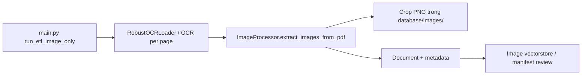
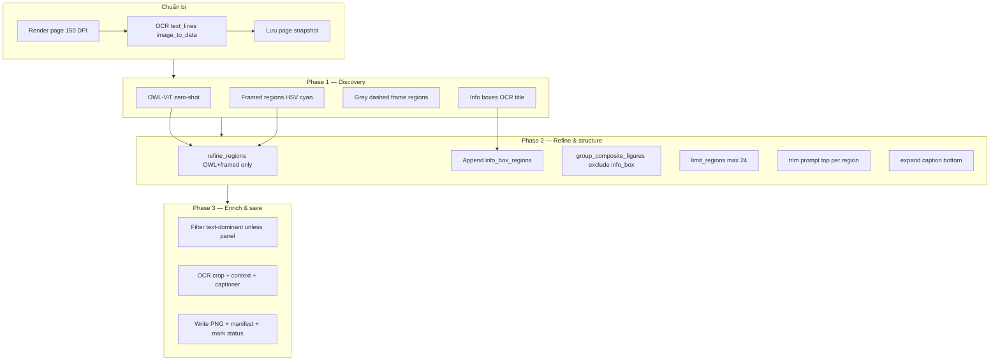

# Tài liệu kỹ thuật — ETL trích xuất hình ảnh từ PDF scan

Tài liệu mô tả **logic**, **luồng xử lý (code flow)** và **cách debug/mở rộng** module trích ảnh trong pipeline RAG. Nội dung bám sát code hiện tại tại `src/etl/image_processor.py` (phiên bản extract **v6**).

**Đối tượng đọc:** developer tiếp nhận ETL, người QA visual bbox, người mở rộng detector cho SGK khác series.

**Tài liệu liên quan:**

| File | Nội dung |
|------|----------|
| `document/technical_handover_rag.md` | Handover tổng thể hệ thống |
| `document/huong_dan_van_hanh_rag.md` | Vận hành, env, reprocess |
| `src/test_etl/test_image_extraction_full.py` | Dry-run 1 trang + overlay QA |
| `src/test_etl/scan_layout_cases.py` | Quét 182 snapshot → phân loại layout + JSON |
| `scripts/test_image_extraction_page6.py` | Smoke test helper (không OWL-ViT) |

---

## 1. Bối cảnh và mục tiêu

### 1.1 Datasource

- PDF **scan** (không có vector text layer đáng tin).
- Luồng tổng thể: **PDF → render page PNG (150 DPI) → OCR text (toàn trang) + tách vùng hình → crop → metadata → vector DB**.

### 1.2 Mục tiêu trích ảnh (ví dụ trang SGK KHTN 6, page 6)

Trên một trang điển hình cần có các loại crop sau:

| Loại | Ví dụ | `image_type` gợi ý |
|------|--------|---------------------|
| **Composite figure** | Cụm Hình 1.1 (a–g) + caption *"Hình 1.1. Một số hoạt động..."* | `composite_figure` (hierarchy) / crop lớn |
| **Sub-figure** | Từng ô a), b), c)… kèm nhãn dưới ảnh | `sub_figure` |
| **Info box** | *Em có biết*, *Tìm hiểu thêm* | `textbook_info_box`, `activity_box` |

**Không** lưu riêng: khung câu hỏi *"Hãy quan sát hình 1.1..."* (chỉ **trim** khỏi bbox figure nếu detector nuốt nhầm).

### 1.3 File code chính

```text
src/etl/image_processor.py   # Toàn bộ detect → refine → crop → metadata
src/etl/image_captioner.py    # Caption VLM (Phase 3, tùy config)
src/etl/processing_status.py  # Skip/reprocess theo IMAGE_EXTRACTION_VERSION
src/config.py                 # OWL_VIT_*, IMAGE_EXTRACTION_VERSION, TESSERACT_CMD
src/test_etl/                 # QA dry-run không ghi DB
main.py                       # run_etl_image_only(), run_etl()
```

---

## 2. Phiên bản thuật toán (`IMAGE_EXTRACTION_VERSION`)

Giá trị mặc định trong `src/config.py`:

```text
v6_grey_dashed_frames
```

### 2.1 Cơ chế reprocess

`ProcessingStatus.needs_image_processing_versioned()` so sánh version đã lưu trên từng page với version hiện tại. Khác version → page được extract lại (không cần xóa thủ công ảnh cũ).

### 2.2 So sánh v5 → v6

| Khía cạnh | v5 (`v5_panel_caption_expansion`) | v6 (`v6_grey_dashed_frames`) |
|-----------|-----------------------------------|------------------------------|
| Khung sub-figure | Chỉ cyan HSV 70–105 | **Thêm** `_detect_dashed_frame_regions` (nét đứt xám, morphology 5×5) |
| Bbox cha nuốt lưới | Một contour cyan lớn (vd. page 11) | `_suppress_container_regions` drop parent khi ≥3 ô con bên trong |
| QA corpus | page 6 ổn | page 11: 2 crop → **8** ô sau v6 (dry-run) |

### 2.3 So sánh v4 → v5 (lịch sử)

| Khía cạnh | v4 | v5 |
|-----------|----|----|
| Phát hiện vùng | OWL-ViT + cyan framed | + OCR-anchored info box |
| Caption / prompt | Expand cố định | `_expand_region_to_caption`, `_trim_region_top_to_exclude_prompt` |
| Info box | Gộp refine → drop | Bypass refine, append sau |

Bump version khi đổi logic detect/expand/trim để corpus tự reprocess.

---

## 3. Luồng end-to-end

### 3.1 Vị trí trong hệ thống



### 3.2 Luồng trên **một page** (hàm `extract_images_from_pdf`)



**Điểm quan trọng:** Phase 2 chạy **theo thứ tự cố định**; thay đổi thứ tự (ví dụ refine info box trước composite) sẽ làm hỏng kết quả đã verify trên page 6.

---

## 4. Phase 0 — Chuẩn bị trang

| Bước | Method | Ghi chú |
|------|--------|---------|
| Render | `_extract_page_image` | `pdf2image`, DPI=150, `POPPLER_PATH` |
| OCR dòng | `_collect_page_text_lines` | `pytesseract.image_to_data`, `lang=vie`, gom word → line + bbox |
| Snapshot | `_save_page_snapshot` | `database/images/<pdf_stem>/pages/page_N_snapshot.png` |
| Context OCR trang | `ocr_text_per_page` (từ loader) | Dùng cho lesson/section title, không thay `text_lines` |

Cấu trúc một **text line**:

```python
{"text": "a) Tìm hiểu vi khuẩn...", "bbox": (x0, y0, x1, y1)}
```

`text_lines` được dùng chung cho: info box, composite expand/trim, sub-figure expand — **một lần OCR/page**, tránh gọi Tesseract lặp cho từng bbox (trừ `_ocr_crop_text` trên crop cuối).

---

## 5. Phase 1 — Phát hiện vùng (region discovery)

Bốn nguồn bbox độc lập, sau đó gộp (info box **chưa** refine ở bước này).

### 5.1 OWL-ViT (`_detect_regions_with_owlvit`)

- Model: `OWL_VIT_MODEL` (mặc định `google/owlvit-base-patch32`).
- Ngưỡng: `OWL_VIT_CONFIDENCE_THRESHOLD` (mặc định `0.1`).
- Input: danh sách `OWL_VIT_TEXT_QUERIES` (công thức, diagram, framed picture, info panel, …).
- Lọc: bbox > ~82% diện tích trang bị bỏ (tránh “cả trang”).

**Ưu điểm:** Ảnh minh họa, vật thể trong SGK.  
**Hạn chế:** Chậm (GPU/CPU), có thể miss panel nền pastel; đôi khi box lệch.

### 5.2 Khung cyan (`_detect_framed_regions`)

- Chuyển RGB → HSV, mask hue **70–105** (viền xanh/teal SGK quanh sub-figure).
- Dùng chung `_regions_from_frame_mask` với dashed (xem 5.2b).

### 5.2b Khung nét đứt xám (`_detect_dashed_frame_regions`) — **v6**

- Mask: S thấp, V trung bình; **loại** vùng cyan đã bắt ở 5.2.
- Morphology **5×5, close×1** (không dùng 9×9×3 — sẽ gộp cả lưới thành 1 contour).
- Case điển hình: **page 11** (Hình 1.5, 7 ô a–h).

**Ưu điểm:** Tách được lưới sub-figure khi không có viền cyan.

**Hạn chế:** Vẫn có thể thiếu composite + caption *Hình X.Y* nếu OCR không có dòng `Hình`; nhãn `a)` gộp trong ảnh → `sub_figure_labels` OCR = 0.

**Cyan framed — thêm chi tiết:** morphology 13×13; lọc ~110×70 px, area 9k–35% trang; bỏ header rộng (`is_wide_header`). Box lớn có thể nuốt prompt → **trim** Phase 2; bbox cha nuốt lưới → **suppress** khi ≥3 ô con (v6).

### 5.3 Info box neo OCR (`_detect_info_boxes_via_titles`) — **mới v5**

Không dựa màu nền. Quy trình:

1. Quét `text_lines`, dòng khớp `INFO_BOX_TITLE_REGEX` (*Em có biết*, *Tìm hiểu thêm*, *Vận dụng*, …).
2. `top` = y0 title − padding (~1.2% page height).
3. Đi xuống các dòng tiếp theo trong “cột” trang (x ∈ 4%–96% width) cho đến khi **gap** > ~6.5% page height hoặc gặp title khác.
4. `left/right` = margin trang 4%–96%.
5. Gán label: `_classify_panel_label` → `textbook_info_box` / `activity_box` / …

**Vì sao cần:** Panel *Em có biết* có nền hồng rất nhạt (S/V thấp), HSV panel detector không ổn định.

### 5.4 HSV pastel (`_detect_colored_panel_regions`) — **không dùng trong pipeline chính**

Method vẫn trong code (fallback / thử nghiệm) nhưng **`extract_images_from_pdf` không gọi** vì:

- False positive: vùng trắng/xanh nhạt **giữa** các sub-figure (ví dụ `detected_hsv_panel_*.png` trong QA cũ).
- Info box đã cover bởi OCR-anchored.

---

## 6. Phase 2 — Refine, composite, post-process

### 6.1 `_refine_regions` (chỉ OWL-ViT + framed)

Pipeline con:

1. Lọc aspect ratio, min size (~45×45), area 1.2k – 75% trang.
2. `_deduplicate_regions` (IoU / contained ratio).
3. `_suppress_container_regions` — **lý do info box bypass refine:**

   - Heuristic: bbox **rất rộng** (>88% width) và **thấp** (<26% height) gần đầu/cuối trang + overlap nhiều vùng nhỏ → coi là “page chrome” và **drop**.
   - Panel *Tìm hiểu thêm* (rộng, gần footer) từng bị drop khi đi qua bước này.

Sau refine: `refined = refined_main + info_box_regions`.

### 6.2 `_group_composite_figures`

**Mục đích:** Tạo bbox **cha** (union) cho cụm sub-figure gần nhau, **giữ** bbox con.

Thuật toán:

1. Connected components trên graph: hai bbox nối nếu `x_gap ≤ margin_x` và `y_gap ≤ margin_y` (margin ~22% width, tối thiểu 24px).
2. Component ≥ 2 box → tính union, expand 2.5%.
3. Nếu có `text_lines`:
   - `_trim_region_top_to_exclude_prompt` trên union.
   - `_expand_region_to_caption(..., is_composite=True)` để kéo xuống *Hình X.Y*.
4. Lọc union: area ≤ 75% trang; union ≥ 1.2× diện tích con lớn nhất; không trùng parent có sẵn (IoU / overlap).

**Tham số v5 — `exclude_regions`:**

- Truyền `info_box_regions` → info box **không** tham gia connected component.
- Tránh union “nuốt” cả trang (figures + Em có biết + Tìm hiểu thêm) → union > 75% → **không tạo composite** (bug đã gặp khi QA: *0 composite parents*).

Kết quả: `composite_regions + regions` (sắp xếp theo area giảm dần).

### 6.3 `_limit_regions_for_extraction`

- Tối đa **24** bbox/page (ưu tiên area lớn, tránh duplicate IoU không phải parent/child).

### 6.4 Post-process từng bbox (trừ info box)

Với mỗi bbox **không** thuộc `info_box_set`:

```text
trimmed = _trim_region_top_to_exclude_prompt(bbox, text_lines, page_height)
final   = _expand_region_to_caption(trimmed, text_lines, w, h, is_composite=False)
```

**Info box:** giữ nguyên bbox OCR-anchored (đã full panel).

#### `_trim_region_top_to_exclude_prompt`

- Quét ~22% chiều cao phía trên bbox.
- Dòng khớp `QUESTION_PROMPT_PATTERNS` (*hãy quan sát*, *hãy tìm*, …) → đẩy `y0` xuống dưới prompt.
- **Wrap continuation:** dòng ngắn ngay dưới prompt (vd. *"tự nhiên."*) vẫn tính là phần prompt nếu gap ≤ 2.5% page height.
- `min_x_overlap_ratio=0.05` để bắt dòng wrap hẹp (trước đây 0.2 → miss trim).

#### `_expand_region_to_caption`

| Mode | `max_gap` dưới bbox | Caption target |
|------|---------------------|----------------|
| `is_composite=True` (trong group_composite) | ~7.5% page H | `FIGURE_CAPTION_REGEX` — *Hình 1.1...* |
| `is_composite=False` (mọi region sau group) | ~4.5% page H | `SUB_FIGURE_LABEL_REGEX` — *a)*, *b)*…; **break** nếu gặp *Hình* |

**Sub-figure — clip X:** OCR thường gộp *"a) ... b) ... c)"* một dòng → chỉ mở rộng x trong `bbox ± 18%` để không leak sang ô kề.

**Regex OCR tolerant:** `[a-hđø]` — chấp nhận OCR đọc `d` → `đ`, `g` → `ø`.

---

## 7. Phase 3 — Metadata, lọc crop, lưu file

Vòng lặp trên từng `bbox` trong `refined` (sau post-process).

### 7.1 Lọc crop

| Điều kiện | Hành vi |
|-----------|---------|
| `width/height < 50` | Bỏ qua |
| `panel_lookup` có label info box | **Không** gọi `_is_text_dominant_crop` |
| Ngược lại | `_is_text_dominant_crop` — loại vùng gần như chỉ chữ (heading) |
| Trùng `image_hash` trên cùng page | Bỏ qua |

### 7.2 Metadata

- `context_text`: `_get_context_text` (OCR band ngang quanh bbox — **render lại PDF page**, có thể tối ưu sau).
- `crop_text`: `_ocr_crop_text` trên crop.
- `figure_label` / `figure_caption`: regex trên local text.
- `hierarchy_type`: `_classify_region_hierarchy` → `composite_figure` / `sub_figure` / `""`.
- `image_type`: ưu tiên `panel_label`; không thì `_infer_image_type`.
- `captioner.caption()`: VLM + context (nếu `IMAGE_CAPTION_ENABLED`).
- `search_text`: ghép label, caption, keywords, context cho retrieval.

### 7.3 Output filesystem

```text
database/images/<PDF_STEM>/
  pages/page_<N>_snapshot.png
  page_<N>_img_<index>.png
```

Manifest review: `IMAGE_REVIEW_MANIFEST_PATH` (JSONL append).

Status: `mark_image_extracted(..., image_extraction_version=IMAGE_EXTRACTION_VERSION)`.

---

## 8. Hằng số regex và pattern (đầu file)

Định nghĩa tại `image_processor.py` (khoảng dòng 62–89):

| Symbol | Mục đích |
|--------|----------|
| `QUESTION_PROMPT_PATTERNS` | Nhận diện câu hỏi/hướng dẫn → trim top |
| `FIGURE_CAPTION_REGEX` | `^Hình \d` / `^Bảng \d` |
| `SUB_FIGURE_LABEL_REGEX` | `^a)` … `^h)` (kèm biến thể OCR) |
| `INFO_BOX_TITLE_REGEX` | Anchor info box |

Chỉnh regex tại đây khi đổi series SGK (vd. thêm *"Ghi nhớ"*, *"Mở rộng kiến thức"*).

---

## 9. Kết quả kỳ vọng — page 6 (SGK KHTN 6)

Sau dry-run `python -m src.test_etl.test_image_extraction_full --page 6`:

| region | source | label | Mô tả |
|--------|--------|-------|-------|
| 00 | composite | composite | Cụm Hình 1.1 + caption, không còn prompt trên |
| 01 | info_box | textbook_info_box | Em có biết + ảnh Marie Curie |
| 02 | info_box | activity_box | Tìm hiểu thêm |
| 03–08 | expanded | sub_figure | 6 ô a,c,b,g,e,d (thứ tự index phụ thuộc detector) |

Overlay QA: `scripts/_out_test_etl_full/04_final_regions.png`.

---

## 10. Công cụ debug và QA

### 10.1 Dry-run full pipeline (khuyến nghị)

```powershell
python -m src.test_etl.test_image_extraction_full --page 6
python -m src.test_etl.test_image_extraction_full --page 10 --out-dir scripts\_qa_page10
```

**Output:**

| File | Ý nghĩa |
|------|---------|
| `01_raw_detections.png` | Xanh dương=OWL, cam=framed, tím=info_box |
| `02_after_refine.png` | Sau dedupe/suppress (+ info box append) |
| `03_after_composite.png` | Xanh lá=composite parent mới |
| `04_final_regions.png` | Bbox cuối trước crop |
| `region_XX__*.png` | Từng crop thực tế |
| `report.json` | bbox, label, kích thước |

**Không** ghi status DB, **không** gọi caption LLM → lặp nhanh khi chỉnh detector.

### 10.2 Smoke test helper (không OWL-ViT)

`scripts/test_image_extraction_page6.py` — dùng snapshot có sẵn, test OCR-anchored / expand / trim. Nhanh nhưng **không** thay thế test full.

### 10.3 Debug HSV (tùy chọn)

`scripts/debug_panel_hsv.py` — in mean/median H,S,V các vùng mẫu để tune `_detect_colored_panel_regions` nếu bật lại.

### 10.4 Checklist khi bbox sai

1. Mở `01_raw_detections.png` — thiếu ở OWL, framed hay info_box?
2. Nếu info box có ở raw nhưng mất ở `02` → kiểm tra có bị đưa vào `_refine_regions` nhầm không (v5: không).
3. Nếu mất composite → xem `03`: có union >75%? info box có trong component không?
4. Composite thiếu caption → `text_lines` có dòng *Hình 1.1*? `is_composite=True` expand chạy chưa?
5. Sub-figure dư prompt → trim: overlap dòng wrap; threshold 0.05.
6. Sub-figure dư caption *Hình 1.1* → expand sub phải **break** tại `FIGURE_CAPTION_REGEX`.
7. Production: bật log `INFO` Phase 1–3 trong `extract_images_from_pdf`.

---

## 11. Mở rộng và hạn chế đã biết

### 11.1 Hạn chế hiện tại

| Vấn đề | Nguyên nhân | Hướng xử lý |
|--------|-------------|-------------|
| Sub-caption gộp một dòng OCR | Tesseract layout | Word-level OCR + split theo vị trí `a)` `b)` |
| `_get_context_text` render lại PDF | Thiết kế cũ | Tái sử dụng `page_text_lines` |
| OWL-ViT chậm trên CPU | Model size | GPU, batch page, hoặc layout model thay thế |
| `image_id` phụ thuộc bbox | Hash payload có tọa độ | Đổi sang `page + figure_label + index` nếu cần stable review |
| Một số sub-figure thiếu nhãn đủ 2 dòng | OCR một dòng cho c) | Tăng `max_gap` hoặc split caption theo cột |

### 11.2 Gợi ý mở rộng (ưu tiên)

1. **Column-aware caption** cho hàng sub-figure (P0 trong review trước).
2. **Caption-first detection:** tìm *Hình X.Y* trước, suy ra vùng ảnh phía trên.
3. **LayoutParser / DocLayout-YOLO** bổ sung hoặc thay OWL-ViT trên scan SGK.
4. Đưa `margin_ratio`, `max_gap`, `info_box max_gap` ra `config.py` / env theo từng bộ sách.
5. `IMAGE_EXTRACTION_DEBUG=true` → luôn ghi overlay per page trong ETL production.

### 11.3 Chỉnh tham số trong code (tham khảo nhanh)

| Method | Tham số | Mặc định (ý nghĩa) |
|--------|---------|---------------------|
| `_group_composite_figures` | `margin_ratio` | 0.22 — khoảng cách gộp sub-figure |
| `_group_composite_figures` | union area cap | 0.75 × page area |
| `_detect_info_boxes_via_titles` | `max_gap` | 0.065 × page height |
| `_expand_region_to_caption` | composite / sub gap | 0.075 / 0.045 × page height |
| `_trim_region_top_to_exclude_prompt` | scan height | 0.22 × page height |
| `_limit_regions_for_extraction` | `max_regions` | 24 |

---

## 12. Sơ đồ phụ thuộc method (tra cứu nhanh)

```text
extract_images_from_pdf
├── _extract_page_image
├── _collect_page_text_lines
├── _save_page_snapshot
├── [Phase 1]
│   ├── _detect_regions_with_owlvit
│   ├── _detect_framed_regions
│   ├── _detect_dashed_frame_regions
│   └── _detect_info_boxes_via_titles
│       └── _classify_panel_label
├── [Phase 2]
│   ├── _refine_regions
│   │   ├── _deduplicate_regions
│   │   └── _suppress_container_regions
│   ├── _group_composite_figures
│   │   ├── _trim_region_top_to_exclude_prompt
│   │   │   ├── _find_lines_in_band
│   │   │   └── _is_question_prompt_text
│   │   └── _expand_region_to_caption (is_composite=True)
│   ├── _limit_regions_for_extraction
│   └── per bbox (non info_box):
│       ├── _trim_region_top_to_exclude_prompt
│       └── _expand_region_to_caption (is_composite=False)
├── panel_lookup (IoU vs info_box_pairs)
└── [Phase 3] foreach bbox
    ├── _ocr_crop_text
    ├── _is_text_dominant_crop (skip if panel)
    ├── _get_context_text
    ├── _extract_figure_label / _extract_figure_caption
    ├── _classify_region_hierarchy
    ├── captioner.caption
    ├── _build_image_search_text
    └── _resolve_image_path + mark_image_extracted
```

---

## 13. Phân loại layout SGK (quét 182 snapshot)

Chạy:

```powershell
python -m src.test_etl.scan_layout_cases
```

Output: `scripts/_layout_scan_SGK_KHTN_6_CD.json` (metrics từng trang + `layout_case`).

### 13.1 Bảng case (heuristic)

| Case ID | Mô tả | Detector / gap code hiện tại | Trang mẫu |
|---------|--------|--------------------------------|-----------|
| **A_CYAN_GRID_MULTI_SUB** | Lưới sub-figure, viền cyan rõ, ≥3 nhãn `a)` OCR | OWL + cyan framed + composite | 6 (chuẩn QA) |
| **B_GREY_DASHED_GRID_MULTI_SUB** | Lưới nét đứt xám, ít cyan, ≥3 sub OCR | **v6** grey-dashed; thiếu composite nếu OCR miss caption | 11, 66 |
| **C_MIXED_CYAN_AND_GREY** | Cả hai loại viền trên cùng trang | Cần dedupe + suppress container | 6 (scan), nhiều trang |
| **D_SINGLE_MAIN_FIGURE** | Một `Hình X.Y`, ít sub | OWL hoặc 1 framed | Rải rác |
| **E_INFO_BOX_DOMINANT** | *Em có biết* / *Tìm hiểu thêm*, ít hình | `_detect_info_boxes_via_titles` | — |
| **F_GREY_STROKE_LOW_CYAN** | Tỷ lệ pixel xám cao, cyan thấp | Grey-dashed (v6) | — |
| **G_CYAN_STROKE_LOW_GREY** | Chủ yếu viền cyan | Cyan framed | — |
| **H_GENERAL_MIXED** | Không khớp rule trên (đa số 136/182) | Cần review thủ công / tune | — |
| **Y_TEXT_OR_DECORATIVE** | Không frame, không crop prod | Bỏ qua | — |
| **Z_UNDEREXTRACT_SUBFIGURE** | OCR thấy ≥2 `a)` nhưng prod crop thiếu | OWL=0, frame miss | 44, … |

### 13.2 Đặc điểm **chưa** có (hoặc yếu) trong `src/etl`

| Gap | Bằng chứng scan (182 trang) | Hướng xử lý (P0→P2) |
|-----|-----------------------------|---------------------|
| Nhãn sub **trong ảnh** (không phải dòng OCR `^a)`) | page 11: `sub_figure_labels=0` dù có 7 ô | Word-level OCR; `findall` `\b[a-h]\)`; layout column |
| Composite + caption *Hình 1.5* | page 11: `figure_captions=1`, 0 composite parent | Caption-first: anchor `FIGURE_CAPTION_REGEX` → union phía trên |
| OWL-ViT = 0 trên lưới dày | page 11 dry-run | Giữ frame detectors; optional layout model |
| Watermark *Cánh Diều* | Nhiễu nền giữa ô | Mask/logo suppress (chưa implement) |
| Hộp câu hỏi vàng (không title info) | Không qua `INFO_BOX_TITLE_REGEX` | HSV prompt band hoặc icon QA |
| `_get_context_text` render lại PDF | Thiết kế cũ | Tái dùng `page_text_lines` |

### 13.3 Thống kê scan (2026-06-04, v6 detector trên snapshot)

| Chỉ số | Giá trị |
|--------|---------|
| Snapshot | 182 |
| Trang `crop_gap ≥ 2` (heuristic) | 120 |
| Case B (grey grid) | 4 |
| Case A (cyan grid) | 1 |
| Case Z (under-extract rõ) | 5 |

Top under-extract (prod v5 cũ): page 134 (gap 10), 66, 44, 104, 124.

---

## 14. Changelog tóm tắt

### v6 (`v6_grey_dashed_frames`)

- `_detect_dashed_frame_regions`, `frame_stroke_metrics`, `_coverage_ratio`.
- `_suppress_container_regions`: drop bbox cha khi ≥3 ô con.
- `src/test_etl/scan_layout_cases.py`.
- Bump `IMAGE_EXTRACTION_VERSION`.

### v5 (`v5_panel_caption_expansion`)

- Tắt HSV colored panel trong `extract_images_from_pdf`.
- Thêm `_detect_info_boxes_via_titles`, `_collect_page_text_lines`, `_expand_region_to_caption`, `_trim_region_top_to_exclude_prompt`.
- Info box bypass `_refine_regions`; `exclude_regions` trong `_group_composite_figures`.
- Post-process trim + expand cho mọi non–info-box region.
- Sub-figure không ăn caption *Hình X.Y*; clip X khi expand sub-caption.
- Trim follow dòng wrap prompt; overlap xả 0.05.
- Thêm `src/test_etl/test_image_extraction_full.py` cho QA visual.
- Default `IMAGE_EXTRACTION_VERSION=v5_panel_caption_expansion`.

---

*Tài liệu đồng bộ với codebase v6. Khi đổi logic, cập nhật mục 2, 5, 13–14 và bump `IMAGE_EXTRACTION_VERSION`.*
