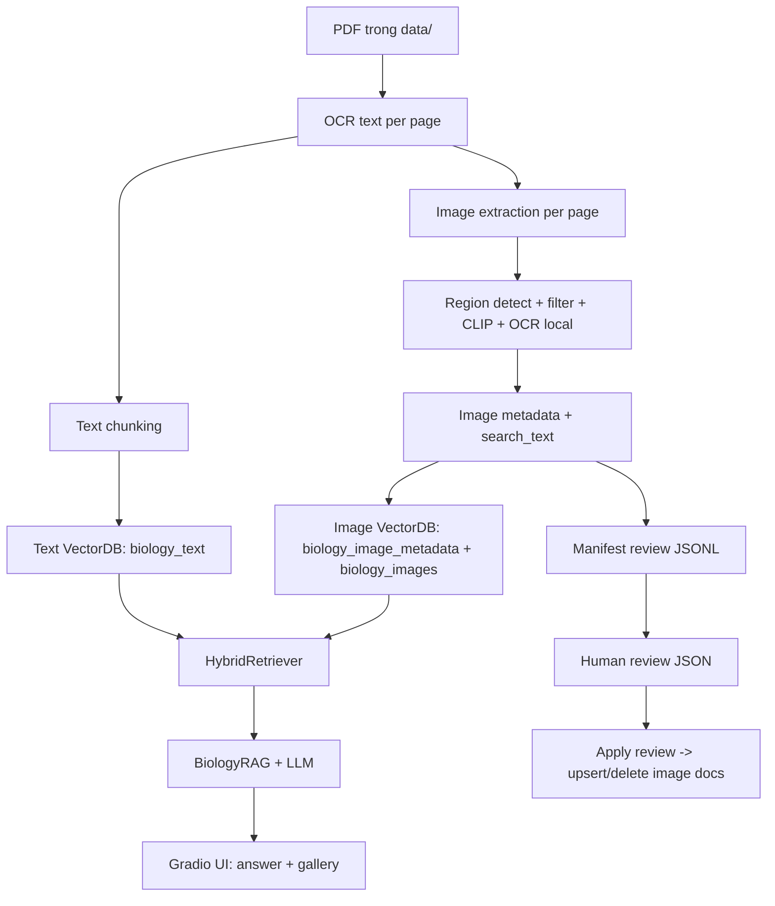

# Technical Handover - Biology RAG

Tài liệu này dành cho người tiếp nhận dự án để:
- Hiểu nhanh kiến trúc và code flow.
- Chạy ETL/retrieval đúng thứ tự.
- Nắm rõ ý nghĩa từng block code chính để debug và thuyết trình.

## 1) Bức tranh tổng thể

Hệ thống gồm 4 phần:
1. Ingestion + ETL text (`src/etl/loaders.py`, `text_splitter.py`, `main.py`).
2. ETL image + metadata + review (`src/etl/image_processor.py`, `image_captioner.py`, `image_review.py`).
3. Storage + retrieval (`src/rag/vectorstore.py`, `image_vectorstore.py`, `hybrid_retriever.py`).
4. QA app (`src/rag/chain.py`, `src/app/assistant.py`).

Luồng end-to-end:



## 2) Cấu trúc codebase

```text
main.py
reset_status.py
src/
  config.py
  etl/
    loaders.py
    cleaner.py
    text_splitter.py
    processing_status.py
    image_processor.py
    image_captioner.py
    image_review.py
  rag/
    vectorstore.py
    image_vectorstore.py
    hybrid_retriever.py
    chain.py
    llm.py
  app/
    assistant.py
document/
  technical_handover_rag.md
  technical_handover_rag.html
```

## 3) Ý nghĩa các block code chính

### 3.1 Entry CLI (`main.py`)

- `run_etl_text_only()`:
  - OCR toàn bộ PDF.
  - Lấy page nào chưa index text (`ProcessingStatus.get_pages_needing_text`).
  - Chunk + `text_db.add_documents()`.
- `run_etl_image_only()`:
  - OCR để lấy `ocr_text_per_page` làm context.
  - Check version extract (`needs_image_processing_versioned`).
  - `ImageProcessor.extract_images_from_pdf()` rồi `ImageVectorDB.add_documents()`.
- `run_etl()`:
  - Chạy text + image trong một pass.
- `run_export_image_review()` / `run_apply_image_review()`:
  - Export JSON review.
  - Apply chỉnh sửa thủ công vào DB.
- `main()`:
  - Parse CLI flags và dispatch flow.

### 3.2 Config trung tâm (`src/config.py`)

- `DATA_DIR`, `PERSIST_DIR`, `IMAGES_DIR`: đường dẫn dữ liệu.
- `IMAGE_EXTRACTION_VERSION`: version thuật toán cắt ảnh, đổi giá trị để buộc reprocess ảnh.
- `IMAGE_CAPTION_*`: cấu hình caption model.
- `IMAGE_RETRIEVER_*`, `IMAGE_RELEVANCE_THRESHOLD`: tham số retrieve ảnh.

### 3.3 OCR & text ETL (`src/etl/loaders.py`, `text_splitter.py`)

- `RobustOCRLoader.load_pdf()`:
  - Render PDF page thành image (`pdf2image`).
  - OCR tiếng Việt (`pytesseract ... lang="vie"`).
  - Trả list `Document(page_content, metadata={source,page})`.
- `TextSplitter`:
  - `chunk_size=400`, `chunk_overlap=120`.

### 3.4 Resume status (`src/etl/processing_status.py`)

- Mỗi page có trạng thái trong collection `processing_status`:
  - `text_indexed`
  - `image_extracted`
  - `image_extraction_version`
  - `last_updated`
- `needs_image_processing_versioned(...)` là block quan trọng để tránh chạy lại toàn bộ khi không cần.

### 3.5 Image ETL (`src/etl/image_processor.py`)

`extract_images_from_pdf()` là core pipeline. Logic theo phase:

1. **Render page**: `_extract_page_image()`
2. **Region proposal (recall-first)**: `_detect_contour_regions()`
   - contour threshold
   - connected components
   - edge rectangles
   - saturation blocks
3. **Refine & dedupe**:
   - `_refine_regions()`
   - `_deduplicate_regions()`
   - `_suppress_container_regions()`
   - `_limit_regions_for_extraction(max_regions=24)`
4. **Per-crop filtering**:
   - `_clip_filter()` (positive prompt vs negative prompt)
   - `_ocr_crop_text()` + `_is_text_dominant_crop()` để loại crop chỉ chứa text.
5. **Metadata enrichment**:
   - `_get_context_text()` OCR vùng quanh ảnh
   - `_extract_figure_label()`, `_extract_figure_caption()`
   - `_infer_image_type()`
   - `ImageCaptioner.caption()` (nếu bật)
   - `_extract_keywords()`
6. **Persist**:
   - save image file
   - append `image_review_manifest.jsonl`
   - tạo `Document(page_content=search_text, metadata=...)`
   - mark page `image_extracted=True` theo version.

### 3.6 Caption model (`src/etl/image_captioner.py`)

- Lazy load model từ `IMAGE_CAPTION_MODEL`.
- Cache theo key `model_name:image_hash` vào `database/image_caption_cache.json`.
- Prompt yêu cầu JSON `{caption, keywords, objects, scene}`.
- Nếu parse fail, dùng fallback keywords.

### 3.7 Human review (`src/etl/image_review.py`)

- `export_for_review(...)`:
  - xuất JSON cho reviewer.
- `apply_review_updates(...)`:
  - merge chỉnh sửa thủ công (`caption_vi_manual`, `keywords_vi_manual`, `review_status`, `is_active`).
  - set `final_caption_vi`, `final_keywords_vi`, rebuild `search_text`.
  - ảnh rejected/inactive: delete khỏi image collections.
  - ảnh approved/edited: upsert lại vào image collections.

### 3.8 Text store (`src/rag/vectorstore.py`)

- Chroma collection: `biology_text`.
- Embedding model: `sentence-transformers/paraphrase-multilingual-MiniLM-L12-v2`.

### 3.9 Image store + rerank (`src/rag/image_vectorstore.py`)

- Hai collection:
  - `biology_image_metadata` (embedding metadata text)
  - `biology_images` (embedding CLIP của image)
- `add_documents()`:
  - build `search_text`
  - upsert metadata embedding + visual embedding.
- `similarity_search()`:
  1. Query metadata collection.
  2. Query visual CLIP collection (query có thể được mở rộng tiếng Anh qua `_expand_query_for_clip`).
  3. Lấy page boost từ text docs liên quan.
  4. Merge + `_rerank()` theo score tổng hợp.
- `_rerank()` dùng:
  - metadata score
  - lexical/direct evidence
  - visual score
  - page boost
  - quality adjustment (size/aspect/text-crop penalty, clip penalty)
- Filter cứng:
  - bỏ `is_active=False`
  - bỏ `review_status in {rejected, deleted}`

### 3.10 Hybrid retrieve (`src/rag/hybrid_retriever.py`)

- `search(query)`:
  - text retrieval trước
  - image retrieval sau (dùng `related_text_docs` làm page-context boost)

### 3.11 QA chain (`src/rag/chain.py`) và app (`src/app/assistant.py`)

- Prompt cưỡng bức trả lời tiếng Việt và chỉ dùng context SGK.
- `FocusedAnswerParser` dọn output model.
- UI trả về:
  - câu trả lời text
  - gallery ảnh liên quan.

## 4) Metadata schema cho ảnh (review-centric)

Schema thực tế trong `image_review_manifest.jsonl` (rút gọn):

| Nhóm | Trường |
|---|---|
| Identity | `image_id`, `image_hash`, `pdf_hash`, `pdf_filename`, `page_number`, `bbox` |
| File path | `image_path`, `page_snapshot_path` |
| Context | `lesson_title`, `section_title`, `figure_label`, `figure_caption`, `context_text`, `crop_text`, `nearby_text` |
| Auto caption | `visual_caption_vi`, `visual_keywords_vi`, `visual_objects_vi`, `visual_scene_vi`, `caption_source` |
| Retrieval text | `keywords_vi`, `caption_vi`, `caption`, `search_text` |
| Review manual | `caption_vi_manual`, `keywords_vi_manual`, `review_status`, `is_active`, `review_notes`, `reviewed_by`, `reviewed_at` |
| Final dùng để index | `final_caption_vi`, `final_keywords_vi` |
| Quality/debug | `image_width`, `image_height`, `clip_positive_score`, `clip_negative_score`, `visual_content_score`, `extraction_version` |

Quy ước review status đề xuất:
- `pending`: chờ review
- `approved`: giữ nguyên auto caption
- `edited`: đã sửa caption/keywords
- `rejected`: loại khỏi retrieval

## 5) Quy trình vận hành chuẩn (fresh DB)

### 5.1 Chuẩn bị môi trường

```bash
pip install -r requirements.txt
cp .env.example .env
```

Nếu chạy Google Colab:

```python
!apt-get update
!apt-get install -y poppler-utils
!apt-get install -y tesseract-ocr tesseract-ocr-vie
```

### 5.2 Làm mới DB

```powershell
Remove-Item -Recurse -Force "D:\personal_repo\project_rag\database"
New-Item -ItemType Directory -Path "D:\personal_repo\project_rag\database" | Out-Null
```

### 5.3 Chạy ETL

```bash
python main.py --text-only
python main.py --image-only
```

Hoặc 1 lệnh full:

```bash
python main.py --etl
```

### 5.4 Human review ảnh

```bash
python main.py --export-image-review database/review_images.json
python main.py --apply-image-review database/review_images.json --review-user charlie
```

### 5.5 Chạy app

```bash
python main.py --app
```

## 6) Gợi ý chất lượng và hiệu năng

1. Nếu caption model gây chậm hoặc sai:
- Đặt `IMAGE_CAPTION_ENABLED=false`.
- Dùng flow review thủ công làm nguồn chân lý.

2. Khi cải tiến thuật toán cắt ảnh:
- Tăng `IMAGE_EXTRACTION_VERSION` (ví dụ `v3`) để reprocess ảnh đúng cách.

3. Nếu thiếu ảnh bị cắt ở một số page:
- Kiểm tra các bước `_detect_contour_regions`, `_refine_regions`, `_suppress_container_regions`, `_limit_regions_for_extraction`.
- Kiểm tra tỷ lệ ảnh bị loại ở `_clip_filter` và `_is_text_dominant_crop`.

4. Nếu retrieval ảnh chưa tốt:
- Ưu tiên nâng chất lượng `figure_caption`, `caption_vi_manual`, `keywords_vi_manual`.
- Điều chỉnh `IMAGE_RELEVANCE_THRESHOLD`, `IMAGE_RETRIEVER_FETCH_K`.

## 7) Checklist bàn giao cho người mới

1. Đọc `README.md` và tài liệu này.
2. Chạy `python main.py --help` để nắm CLI.
3. Chạy thử trên 1 PDF nhỏ với `--text-only`, `--image-only`.
4. Export/apply review 1 vòng để hiểu cơ chế human-in-the-loop.
5. Chạy `--app` và kiểm tra cả text retrieval lẫn image gallery.

## 8) Kịch bản thuyết trình (10-15 phút)

1. Bài toán:
- OCR tiếng Việt + retrieval text/image cho SGK.

2. Kiến trúc:
- ETL text + ETL image + hybrid retrieval + QA app.

3. Điểm kỹ thuật nổi bật:
- Page-level resume theo version.
- Image pipeline nhiều tầng filter (detector + CLIP + OCR text-dominant).
- Human review để kiểm soát chất lượng image metadata.

4. Demo:
- Chạy `--etl`.
- Export review và sửa 1 caption.
- Apply review.
- Hỏi trong app để thấy ảnh retrieve thay đổi theo caption manual.

5. Roadmap:
- Fine-tune/prompting caption model tốt hơn tiếng Việt.
- Dashboard review nội bộ thay cho sửa JSON thủ công.
- Thêm bộ eval định lượng cho image retrieval.
