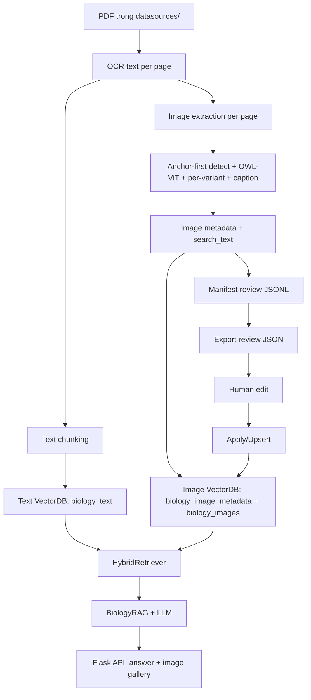

# Technical Handover - Biology RAG

Tài liệu này dành cho người tiếp nhận dự án để:
- Hiểu nhanh kiến trúc và code flow.
- Chạy ETL/retrieval đúng thứ tự.
- Nắm rõ ý nghĩa từng block code chính để debug và thuyết trình.
- Nắm quy trình CRUD metadata ảnh (export DB, upsert 1 item, apply batch).

## 1) Bức tranh tổng thể

Hệ thống gồm 4 phần:
1. Ingestion + ETL text (`src/etl/loaders.py`, `text_splitter.py`, `main.py`).
2. ETL image + metadata + review (`src/etl/image_processor.py`, `image_captioner.py`, `image_review.py`).
3. Storage + retrieval (`src/rag/vectorstore.py`, `image_vectorstore.py`, `hybrid_retriever.py`).
4. Flask API (`src/rag/chain.py`, `src/app/api.py`, `src/app/dependencies.py`).

Luồng end-to-end:



## 2) Cấu trúc codebase

```text
main.py                      # entry CLI (ETL, review CRUD, API)
datasources/                 # PDF SGK đầu vào
database/                    # Chroma DB + ảnh crop + manifest (sinh ra khi chạy)
src/
  config.py                  # cấu hình tập trung (đọc .env)
  etl/
    loaders.py               # OCR PDF -> Document
    cleaner.py               # chuẩn hóa text tiếng Việt
    text_splitter.py         # chunking
    processing_status.py     # checkpoint resume theo version
    image_processor.py       # detect/crop ảnh (anchor-first, per-variant)
    image_captioner.py       # caption ảnh bằng VLM
    image_review.py          # CRUD metadata ảnh (export/upsert/apply/replace)
    local_image_importer.py  # import ảnh từ thư mục, bỏ qua PDF
  rag/
    vectorstore.py           # text store + relevance gate
    image_vectorstore.py     # image store (CLIP + metadata) + rerank
    hybrid_retriever.py      # gộp text + image retrieval
    query_intent.py          # phát hiện ý định hỏi ảnh
    chain.py                 # prompt + LLM + parser
    llm.py                   # nạp Qwen2.5
  app/
    api.py                   # Flask API (chat/stream, ETL, image CRUD)
    dependencies.py          # singleton nạp model 1 lần
  utils/
    download_models.py       # tải sẵn model để chạy offline
  test/                      # bộ đánh giá RAG (IR metrics + LLM judge) & QA ETL ảnh
document/                    # tài liệu (xem document/README.md)
skills/etl-textbook-images/  # runbook chi tiết cho ETL ảnh
```

## 3) Ý nghĩa các block code chính

### 3.1 Entry CLI (`main.py`)

- `run_etl_text_only()`: OCR -> split -> upsert text chunks.
- `run_etl_image_only()`: extract ảnh -> enrich metadata -> upsert image docs.
- `run_etl()`: full ETL text + image.
- `run_export_image_review()`: export file review cho người dùng.
- `run_export_image_db()`: export snapshot metadata DB từ manifest.
- `run_upsert_image_review_item()`: upsert 1 object JSON theo `image_id`.
- `run_apply_image_review()`: apply batch review file, hỗ trợ filter `pdf_filename`.
- `run_replace_image_db()`: replace toàn bộ manifest và rebuild image vector index theo snapshot JSON.

CLI flags mới quan trọng:
- `--export-image-db <path>`
- `--upsert-image-review-item <item.json>`
- `--replace-image-db <path>`
- `--review-pdf` áp dụng cho cả export review, export DB và apply review.

### 3.2 Config trung tâm (`src/config.py`)

- `DATA_DIR`, `PERSIST_DIR`, `IMAGES_DIR`: đường dẫn dữ liệu. Có thể override bằng `RAG_DATA_DIR` và `RAG_DATABASE_DIR`.
- `TESSERACT_CMD`, `POPPLER_PATH`: đường dẫn dependency OCR/render PDF trên Windows.
  - Nếu chưa biết path cài đặt, xem `document/windows_tools_setup.md`.
  - Repo có sẵn `windows_tools/poppler.zip` và `windows_tools/tesseract-ocr.zip`.
- `IMAGE_EXTRACTION_VERSION`: version extract để điều khiển reprocess.
- `IMAGE_CAPTION_*`: cấu hình caption model.
- `IMAGE_RETRIEVER_*`, `IMAGE_RELEVANCE_THRESHOLD`: tham số retrieve ảnh.

### 3.2b Database trên Google Drive khi chạy Colab

Trên Colab, `./database` nằm trong runtime tạm. Để ETL có thể resume sau khi runtime bị ngắt, mount Drive và set biến môi trường trước khi import/chạy app:

```python
from google.colab import drive
drive.mount("/content/drive")

import os
os.environ["RAG_DATABASE_DIR"] = "/content/drive/MyDrive/project_bio_rag/database"
```

Khi `RAG_DATABASE_DIR` được set, các thành phần sau đi theo Drive path:
- Chroma DB text/image/status.
- `processed_files.txt`.
- `images/`.
- `image_review_manifest.jsonl`.
- `image_caption_cache.json`.

Nếu PDF cũng nằm trên Drive:

```python
os.environ["RAG_DATA_DIR"] = "/content/drive/MyDrive/project_bio_rag/data"
```

### 3.3 OCR & text ETL (`src/etl/loaders.py`, `text_splitter.py`)

- `RobustOCRLoader.load_pdf()`:
  - render PDF page bằng `pdf2image`
  - OCR bằng `pytesseract(lang="vie")`
  - trả list `Document(page_content, metadata={source,page})`
- `TextSplitter`: `chunk_size=400`, `chunk_overlap=120`.

### 3.4 Resume status (`src/etl/processing_status.py`)

- Theo dõi trạng thái từng page:
  - `text_indexed`
  - `image_extracted`
  - `image_extraction_version`
- `needs_image_processing_versioned(...)` giúp skip page đã xử lý đúng version.

### 3.5 Image ETL (`src/etl/image_processor.py`)

`extract_images_from_pdf()` dùng cơ chế **anchor-first deterministic** (v15), chọn lớp xử lý theo nhà xuất bản (CD / CTST / KNTT) qua `make_image_processor()`:
1. render page ở DPI cao.
2. tìm **anchor** từ OCR (nhãn `Hình`, `Bảng`, box "Em có biết"...) để biết chỗ nào chắc chắn có ảnh.
3. detect vùng ứng viên bằng OWL-ViT + heuristic khung/đường nét theo từng variant.
4. dedupe + suppress container + ghép sub-figure thành composite.
5. enrich metadata (`figure_*`, context OCR, caption + keywords từ VLM).
6. build `search_text`, lưu file ảnh + snapshot page, append manifest, mark status theo version.

Chi tiết thuật toán xem `document/image_etl_technical.md` và `skills/etl-textbook-images/`.

### 3.6 Caption model (`src/etl/image_captioner.py`)

- Lazy load model caption theo `IMAGE_CAPTION_MODEL`.
- Cache theo `model_name:image_hash`.
- Parse JSON caption + fallback keywords.

### 3.7 Human review và CRUD metadata (`src/etl/image_review.py`)

Các chức năng chính:
- `export_for_review(...)`: export JSON review.
- `export_db_snapshot(...)`: export full metadata DB snapshot.
- `upsert_review_item(...)`: upsert 1 item theo `image_id`.
- `apply_review_updates(...)`: apply batch JSON array, có thể filter `pdf_filename`, có thể tạo mới item.

Rule cập nhật dữ liệu:
- Trường manual ưu tiên:
  - `caption_vi_manual` -> `final_caption_vi`
  - `keywords_vi_manual` -> `final_keywords_vi`
- `search_text` luôn được rebuild trước khi upsert.
- Item `review_status in {rejected, deleted}` hoặc `is_active=false` sẽ bị delete khỏi image vector collections.

### 3.8 Text store (`src/rag/vectorstore.py`)

- Chroma text collection: `biology_text`.
- Embedding: `sentence-transformers/paraphrase-multilingual-MiniLM-L12-v2`.

### 3.9 Image store + rerank (`src/rag/image_vectorstore.py`)

- 2 collections:
  - `biology_image_metadata`
  - `biology_images`
- `similarity_search()`:
  - metadata query + visual CLIP query + page context boost + rerank.
- Filter cứng khi trả kết quả:
  - loại `is_active=false`
  - loại `review_status in {rejected, deleted}`.

### 3.10 Hybrid retrieve (`src/rag/hybrid_retriever.py`)

- text retrieval trước, image retrieval sau.
- image retrieval dùng `related_text_docs` để tăng độ chính xác theo page context.

### 3.11 QA chain (`src/rag/chain.py`) và Flask API (`src/app/api.py`)

- Prompt ép tiếng Việt và chỉ dùng context SGK.
- Flask API trả về answer + image gallery qua `/api/chat`.

## 4) Metadata schema cho ảnh

Schema chính trong `image_review_manifest.jsonl`:

| Nhóm | Trường |
|---|---|
| Identity | `image_id`, `image_hash`, `pdf_hash`, `pdf_filename`, `page_number`, `bbox` |
| File path | `image_path`, `page_snapshot_path` |
| Context | `lesson_title`, `section_title`, `figure_label`, `figure_caption`, `context_text`, `crop_text`, `nearby_text` |
| Auto caption | `visual_caption_vi`, `visual_keywords_vi`, `visual_objects_vi`, `visual_scene_vi`, `caption_source` |
| Review | `caption_vi_manual`, `keywords_vi_manual`, `review_status`, `is_active`, `review_notes`, `reviewed_by`, `reviewed_at` |
| Final retrieval | `final_caption_vi`, `final_keywords_vi`, `search_text` |
| Debug/quality | `clip_positive_score`, `clip_negative_score`, `visual_content_score`, `extraction_version` |

## 5) Quy tắc apply/upsert và ảnh hưởng DB

1. `--apply-image-review` là upsert theo item trong file JSON, không phải sync full.
2. Xóa item khỏi JSON array không đồng nghĩa xóa khỏi DB.
3. Muốn xóa khỏi retrieval:
- set `review_status = rejected|deleted`, hoặc
- set `is_active=false`, hoặc
- set `delete=true`.
4. `--upsert-image-review-item` cho phép tạo mới item nếu `image_id` chưa tồn tại.
5. `--replace-image-db` là authoritative snapshot sync: manifest được ghi lại theo file JSON, item không còn trong file sẽ bị xóa khỏi manifest và image index.
6. Nếu `image_path` không tồn tại, metadata có thể được lưu ở manifest nhưng visual embedding có thể không thêm được.

## 6) Lệnh vận hành CRUD metadata

Export full metadata DB:

```bash
python main.py --export-image-db database/all_image_db.json
python main.py --export-image-db database/sgk6_db.json --review-pdf "SGK KHTN 6 CD.pdf"
```

Upsert một item:

```bash
python main.py --upsert-image-review-item database/one_item.json --review-user charlie
```

Apply batch theo PDF:

```bash
python main.py --apply-image-review database/review_images.json --review-pdf "SGK KHTN 6 CD.pdf" --review-user charlie
```

Replace toàn bộ image DB theo snapshot:

```bash
python main.py --export-image-db database/all_image_db.json
python main.py --replace-image-db database/all_image_db.json --review-user charlie
```

Payload snapshot tối thiểu/rút gọn:

```json
[
  {
    "image_id": "manual_0001",
    "pdf_filename": "SGK KHTN 6 CD.pdf",
    "page_number": 88,
    "image_path": "D:/personal_repo/project_rag/database/images/SGK KHTN 6 CD/page_88_img_manual_1.png",
    "page_snapshot_path": "D:/personal_repo/project_rag/database/images/SGK KHTN 6 CD/pages/page_88_snapshot.png",
    "bbox": "0,0,100,100",
    "caption_vi_manual": "Hai con hải mã trên tảng băng",
    "keywords_vi_manual": "hải mã, vùng cực, băng tuyết",
    "review_status": "edited",
    "is_active": true
  },
  {
    "image_id": "bad_image_0001",
    "review_status": "rejected",
    "is_active": false
  }
]
```

## 7) Quy trình vận hành chuẩn (fresh DB)

1. `pip install -r requirements.txt`
2. `cp .env.example .env`
3. Nếu Colab: `apt-get update`, `poppler-utils`, `tesseract-ocr`, `tesseract-ocr-vie`
4. `python main.py --text-only`
5. `python main.py --image-only`
6. `python main.py --export-image-review database/review_images.json`
7. chỉnh review
8. `python main.py --apply-image-review ...`
9. `python main.py --api --port 5000`

## 8) Checklist bàn giao

1. Chạy `python main.py --help` kiểm tra CLI.
2. Test `--export-image-db` và `--upsert-image-review-item` trên 1 item mẫu.
3. Test `--apply-image-review --review-pdf` để tránh update nhầm toàn bộ dữ liệu.
4. Validate kết quả qua Flask API hoặc frontend (text + gallery).

## 9) Kịch bản thuyết trình (10-15 phút)

1. Bài toán và kiến trúc tổng thể.
2. ETL image recall-first + filter nhiều tầng.
3. Human-in-the-loop metadata để tăng precision retrieve ảnh.
4. Demo CRUD metadata:
- export DB
- upsert 1 item
- apply batch theo pdf
- xem thay đổi trên gallery.
5. Roadmap:
- review UI thực thụ
- eval pipeline cho image retrieval.
